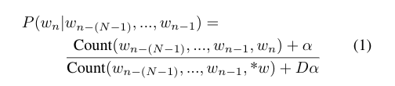
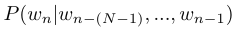
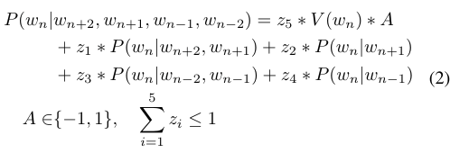

# Introduction

This library is for the purpose of creating an affect-aware bidirectional fill-in-the-blank N-Gram NLP model.

Train the model on a corpus of text and positive/negative-sentiment labeled words, and use the model to fill-in-the-blank on neutral sentence stems to create affective sentences.

### Table of Contents
1. [Installation](#Installation)
1. [How Training Data Should be Formatted](#Formatting)
1. [Where To Get Training Data](#WhereData)
1. [Explanation of How it Works](#Explanation)
1. [Credits](#Credits)

# Installation

To install the library, just clone it to your system.  This library is written in scala and requires sbt.

In addition to the library, to train the model, you will need a corpus of text upon which to train it, as well as AFFIN files describing emotional valence of words.  How to format the data is discussed in the [next section](#Formatting).  From where you can retrieve examples of such data is discussed in the subsequent [data sourcing section](#WhereData).

Before running, note the `src/main/resources/local.default.properties` file.  It contains settings.  These can be overwritten by adding a `src/main/resources/local.properties` file in the same format.

Here are explanations for some of the settings

General settings:
* **verbose_logging** : set to **true** or **false**
* **stop_words** : a list of words to ignore, both during training and prediction.  So, for example, if stop words included "I" and "this", a sentence "I love using this library" would be sorted into the following 2- and 3-grams:  ( (love, using), (using, library), (love, using, library) ), as the stop words are skipped.

Training Settings:
* **corpus_file_folder** : which folder contains the corpus of dialogue on which to train
* **afinn_filenames** : a list of relative paths to AFFIN files

Prediction Settings:
* **ngram_weightings** : four values weighting the forward bigram, reverse bigram, forward trigram, and reverse trigram components of the predictor
* **affect_weighting** : how much weight to give the affect component of the predictor
* **ignore_words** : words to ignore as a _result_. For example, 'kill' is a very negative word, and it might appear in natural language enough that you don't want to add it to **stop_words**, but it may be the case that you also don't want your robot to choose that particular word.
* **input_csv_filename** : the relative path to the neutral sentences stems
* **output_csv_positive_filename** : output file for positive fill-in-the-blanks
* **output_csv_negative_filename** : output file for negative-fill-in-the-blanks
* **output_details** : output file for more detailed information
* **output_summary** : output file for summary information

# How training data should be formatted

Training corpus for natural language (which by default should be placed into the `corpusfiles` directory) can be any format.  Some preprocessing is done to remove punctuation as such.  It is expected to take in movie scripts.  It can handle anything, although if you use other formats it is recommended to do some preprocessing yourself if you want to be sure.

The AFINN files note what emotional valence different words have.  You can have multiple files, be sure to list them in the **afinn_file** property.  The format is a two-column tab-separated file, where the first column is the word, and the second column is a number from -5 to 5. (Positive is positive valence.)

# Training and Predicting

To train the model, run

    sbt train

To run a prediction to fill in the blank on the provided sentence stems, run

    sbt predict

# Where to get Training Data

Although you can use any corpus and AFINN-formatted you desire, we describe here what worked well for us.

For the corpus, we used retrieved data from the IMSDb corpus, which has movie scripts available for research purposes.  We are grateful to the work done by Marylin A. Walker et al in making the `Film Corpus 1.0` available.  Learn more at [https://nlds.soe.ucsc.edu/fc]. Note that if you also draw from this database they ask you to cite two of their papers.

For the AFFIN-formatted files, we used AFFIN files labeled by Finn Årup Nielsen.  Learn more at [http://www2.imm.dtu.dk/pubdb/views/publication_details.php?id=6010].  Note that if you use their AFFIN files, they ask you to cite a paper listed there.

# Explanation of How it Works

To give our robot's language an affect, we developed an affect-aware bidirectional fill-in-the-blank N-Gram model.

An N-gram model trains on corpora and counts how often each word follows each preceding N-words. From these counts, we construct a probability that any particular word follows a previous sequence of words. This probability is derived by computing the frequency of that particular word's occurrence after a given sequence compared to the frequency of any observed word following the same sequence. After creating counts of sequences of words of length N+1, the probability can be expressed as:

where  is the probability that a particular word *wn* follows a particular sequence of *N* other words, and _*w_ is a wildcard meaning ''any word observed as completing this sequence''.  In our usage, as shown, we add _+α_ and _+Dα_ terms as Laplacian smoothing to account for situations where a word was not observed. We use α=1 and D= (number of words that could fit *$w$ for the given preceding sequence).

To make the language not just natural but connoting a specific emotion (''affect-aware''), we took advantage of the AFINN Affect Dictionary, which rates the emotional valence of a word on a scale from -5 to 5.

After the model is trained, we feed in a bank of neutral sentence stems (sentences with fill-in-the-blanks).  The model selects words to fill in the blanks that are appropriate given the sentence and that give the sentence appropriate affect. This also allows us to use bidirectional N-grams--training and predicting based on the words preceding _and_ following a word to be predicted. We use both bigrams and trigams (N=2, N=3) in the forward and reverse direction.

The final equation our model uses to select the words to fill out the sentences the robot will say is given by

where the probabilities on the right-hand side are calculated according to equation (1), _V_ gives the AFINN affective valence of a word (or 0 if not in the dictionary), _A_ indicates whether the affect is encouraging (+1) or discouraging (-1), and the *zi* values are weights.

We trained our model on transcripts of popular films from the IMSDb archive, but as mentioned, you can use whatever corpus you like. During training and prediction, a set of ''stop words'' (such as ''is'' and ''and'') is ignored for the purposes of defining sequences of words. Numerals and punctuation are also filtered out before training. Additionally, during prediction, certain words are ignored (blacklisted), such as ''kill''.  This is to prevent the robot from being too vulgar, saying things that do not make sense, hoping for a participant's death, or making comments that are otherwise offensive or uninterpretable.

# Credits

This library was created by Aaron M. Roth, based in part on python code written by Tamara Amin.

